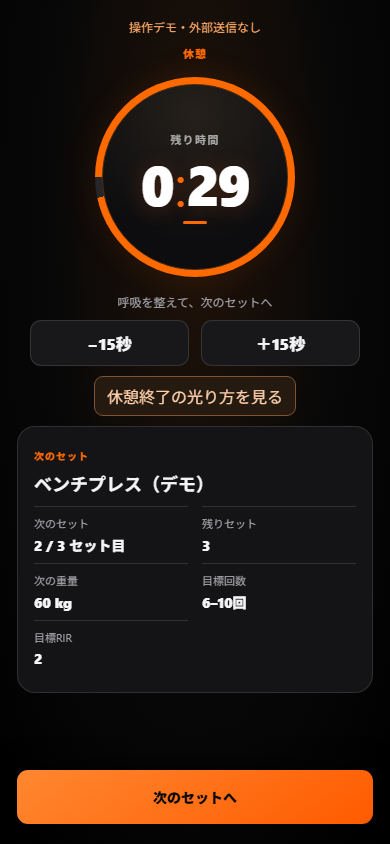

# Open Workout AI

**初めての方へ： [Windows向け日本語導入ガイド](docs/setup.md)**

- まず試す → [Demoを起動](docs/setup.md#phase-a)
- 自分のクラウドへ保存 → [Supabase作成・接続・保存確認](docs/supabase-setup-ja.md)
- 困ったとき → [エラー別の解決方法](docs/troubleshooting.md)

メニューを読み込み、重量・回数を記録し、途中の状態を復元するアプリです。Demoは架空データを端末だけに保存します。自分のSupabaseを設定するとクラウド保存もできます。Google Sheetsは基本導入に不要です。

Open Workout AI is a local-first PWA that safely turns a workout prescription into an executable session, preserves progress offline, syncs completed records, and validates results before they become official history.

It is not only a workout tracker. It supports the loop:

**Plan → Execute → Record → Validate → Learn → Next Plan**

> Latest release: [GitHub Releases](https://github.com/110soma/open-workout-ai-clean/releases/latest). See [v0.1.1 release notes](docs/release-notes-v0.1.1.md).

> This public repository is independent of the maintainer's private daily-use environment. Examples are synthetic. Historical audit documents describe pre-release work, not the current publication status.

`"private": true` in `package.json` prevents accidental npm package publication. This GitHub repository is public.

## Why this is different

- A prescription is converted into stable session and set records.
- User input is saved to IndexedDB immediately; network work happens afterward.
- Active sessions survive reloads and temporary offline use.
- Stable IDs and validation reduce duplicate or mismatched records.
- Demo mode uses synthetic data and never sends workout records externally.
- Supabase is supported for personal cloud sync.
- Google Sheets is an optional server-only adapter, not a browser requirement.

## Current features

- Installable React/Vite PWA
- Local-first IndexedDB storage
- Prescription adapter
- Weight, reps, and optional RIR entry
- Add/delete sets with stable IDs
- Rest timer based on absolute timestamps
- Active and completed session recovery
- Supabase authentication and per-user sync
- Duplicate protection and validation building blocks
- Mobile-first UI for 390×844 screens
- Safe synthetic Demo mode

## Quick start: Demo mode

Requirements: Node.js 22+ and npm.

```bash
npm ci
npm run dev
```

On Windows PowerShell, use:

```powershell
npm.cmd ci
npm.cmd run dev
```

Open the shown local URL. Without Supabase settings, the app automatically uses Demo mode. Demo data is synthetic, stored in a separate browser database, and is not sent to cloud or official-save endpoints.

Demo mode has been verified in mobile (390×844) and desktop (1440×900) browser tests, including local recovery, completion, and no external requests. Supabase-connected startup and account isolation are tested with local mock responses and an isolated database engine. A third party's first installation using a new real Supabase project has **not been field-tested**. Google Sheets remains an optional, experimental integration.

## Connect your own Supabase

1. Create a Supabase project and an Authentication user.
2. Run the SQL files in `supabase/migrations/` in numeric order.
3. Copy `.env.example` to `.env.local`.
4. Set only your Supabase Project URL and publishable key in the `VITE_*` variables.
5. Set `VITE_DEMO_MODE=false`.
6. Follow the [Japanese example-prescription import steps](docs/supabase-setup-ja.md#phase-d) and sign in. A new account starts empty; no private snapshots are required.

Never place a service-role key or secret key in a `VITE_*` variable. `VITE_*` values are visible in the browser.

See [Setup](docs/setup.md) and [Architecture](docs/architecture.md).

The maintainer reports a successful assisted installation on a new real Supabase project, including login and workout cloud storage. This is **not** an independent beginner test of these instructions. The real Dashboard steps still need that manual acceptance test.

## Example data

- `examples/prescription.example.json`
- `examples/workout.example.json`

These are fictional fixtures. They are not real users or real workout history.



## Optional Google Sheets integration

The core app works without Google Sheets. The experimental optional gateway is restricted to exactly one configured account and is disabled by default. It requires server-only credentials and a compatible workbook schema. See [Optional Sheets adapter](docs/optional-google-sheets.md).

## Testing

```bash
npm test
npm run build
npm run test:e2e
npm run audit:public
```

`npm run verify` runs tests, build, browser checks, working-file audit and complete Git-history audit. GitHub Actions runs the same checks without application secrets.

## Security

Read [SECURITY.md](SECURITY.md). Real credentials, real workout history, personal URLs, and private deployment metadata must never be committed.

## Current limitations

- UI text is primarily Japanese.
- Multi-user product administration is not complete.
- Local storage is isolated by Supabase project and account. Switching accounts remounts the app; unowned data from older candidates is never automatically assigned to an account.
- Data export and account deletion are administrator-run in v0.1; there is no in-app flow yet.
- A fresh third-party Supabase project has not yet been field-tested; the included migrations and instructions have been reviewed locally.
- Optional Sheets integration is experimental, single-owner, and expects a specific schema. It is not required for Demo/Supabase use.
- Formal PR/progression/AI feedback features are outside v0.1.0.

## Roadmap

See [OSS roadmap](docs/oss-roadmap.md) and [v0.1.1 release notes](docs/release-notes-v0.1.1.md).

## 日本語の短い説明

AIなどが作ったトレーニングメニューをPWAで実施し、通信が不安定でも端末に保存し、終了後に記録の重複や不整合を確認できる仕組みです。Google SheetsがなくてもDemoとSupabaseの基本機能を使える設計です。

## Contributing and license

See [CONTRIBUTING.md](CONTRIBUTING.md). Open Workout AI is licensed under the [MIT License](LICENSE).
